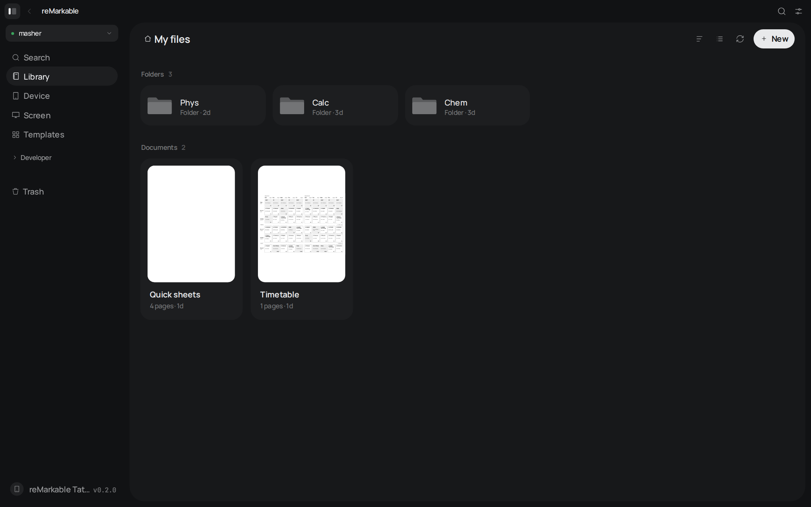
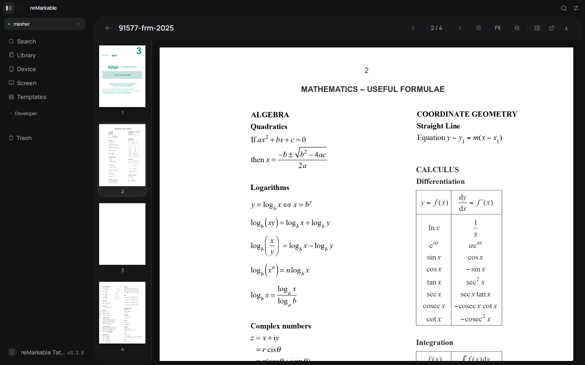
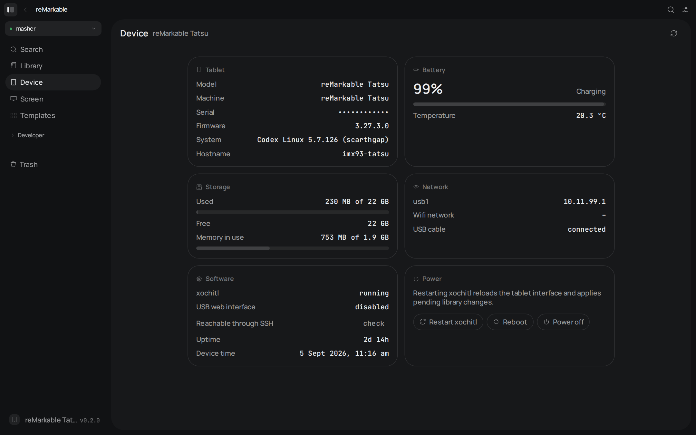
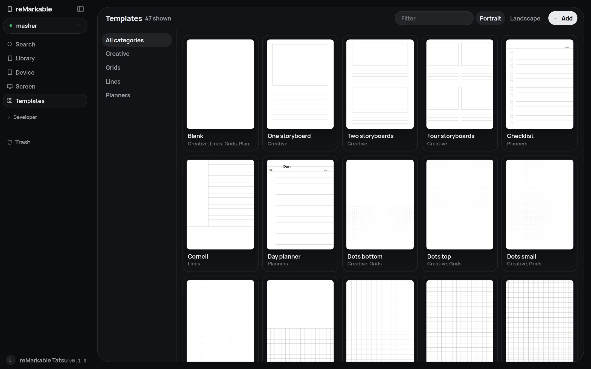
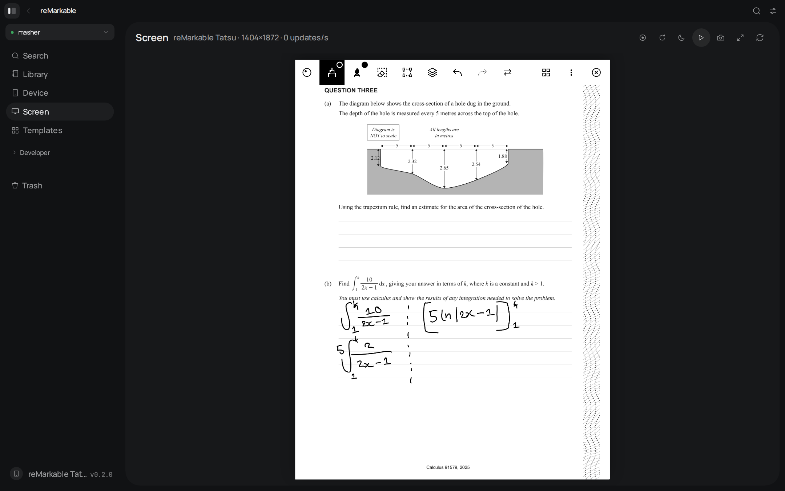
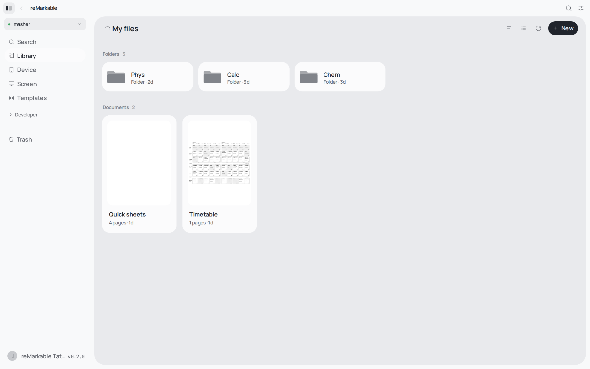

# reMarkable WebUI

Local web interface for reMarkable paper tablets. Talks to the tablet over SSH, so it works over the USB cable with no wifi at all, and over wifi when SSH is enabled there.

## Screenshots













## What it does

- Library browser for the tablet's documents: folders, notebooks, PDFs and EPUBs, with thumbnails, search (⌘K), grid and list views, sorting, drag and drop.
- Rename, move, pin, trash, restore and permanently delete. Create folders and blank notebooks.
- Upload PDF, EPUB and rmdoc files by dropping them on the library.
- Open any document page in the browser. Notebook strokes are rendered from the `.rm` v6 files, PDF pages are drawn underneath with pdf.js, templates are pulled from the tablet.
- Download documents as PDF (rendered by the tablet), as an rmdoc archive, or a single page as SVG.
- Raw file explorer for the whole filesystem: browse, upload, download, rename, delete, edit text files in place.
- Device panel: model, firmware, serial, battery, storage, memory, network, xochitl status. Restart xochitl, reboot, power off.
- Live screen mirror with rotation, inversion and PNG screenshots.
- Full terminal (xterm.js) on the tablet.
- Template gallery.

## Requirements

- Node.js 22 or newer.
- SSH access to the tablet. On reMarkable 1 and 2 this is on by default. On reMarkable Paper Pro enable developer mode first (Settings › General › Software › Advanced › Developer mode). Enabling it factory resets the tablet.
- The root password from Settings › General › Help › Copyrights and licenses.

## Connecting

Over USB the tablet always answers on `10.11.99.1`. Plug in the cable, start the app, add a device with that host and the root password. No wifi needed.

Over wifi use the address shown under Settings › Wi-Fi. SSH over wifi is disabled by default on the Paper Pro; enable it with the `rm-ssh-over-wlan` tool on the tablet.

Saved devices, including passwords, live in `~/.config/remarkable-webui/devices.json` with mode 600. The server only listens on `127.0.0.1`.

## Running

```sh
npm install
npm run dev
```

The Vite dev server runs on http://localhost:5173 and proxies `/api` and `/ws` to the Node backend on port 8787.

Production build:

```sh
npm run build
npm start
```

`npm start` serves the built client and the API from the same port (8787, or `PORT`).

Tagged releases ship a tarball with the client already built. Unpack it, run `npm ci --omit=dev`, then `npm start`.

## How changes reach the tablet

xochitl, the tablet's interface, only reads document metadata at startup. After a rename, move, upload or delete the app therefore restarts xochitl on the tablet (about two seconds, the open notebook closes). Turn this off per device in Settings › General to batch changes and restart manually from the sidebar.

## Exporting PDF

"Download PDF" asks the tablet itself to render the document through its USB web interface, tunnelled over the SSH connection. That needs the USB cable connected and "USB web interface" enabled under Settings › Storage. rmdoc and SVG exports do not depend on it.

## Screen mirror

- reMarkable 1: reads `/dev/fb0`.
- reMarkable 2: reads the framebuffer from xochitl's memory using the offsets known from reStream, picked by firmware version.
- Tablets with the DRM display stack (Paper Pro and newer, including the i.MX93 "Tatsu" hardware): reads the panel size from the device tree, then walks the buffer headers after the last `/dev/dri/card0` mapping in xochitl's memory, the way goMarkableStream does.

On first use the app copies a small static helper (`tools/rmfb.c`, prebuilt in `server/bin/` for aarch64 and armv7) to `/home/root/.cache/remarkable-webui/` on the tablet. It reads the framebuffer 25 times a second and streams only the rows that changed, run-length encoded, so a stroke costs a few kilobytes and a full refresh about 50 KB. Press `f` for full screen, `r` to rotate, `i` to invert.

Screenshots and recordings are rendered in the browser from the mirrored canvas with the chosen rotation and inversion applied, so they cost the tablet nothing extra. Recordings are WebM (VP9 where available) captured at up to 60 frames per second with a proper duration header.

Rebuild the helper with zig: `zig cc -target aarch64-linux-musl -O2 -static -s -o server/bin/rmfb-aarch64 tools/rmfb.c` (and `arm-linux-musleabihf` for `rmfb-armv7l`).

## Templates

Firmware 3.27 ships templates as `.template` JSON files (paths, groups with repeat rules, text, and arithmetic expressions). The app evaluates that format itself, both behind notebook pages and in the template gallery. Older firmware with `.svg` and `.png` templates is served as images.

## Custom templates

Since firmware 3.17 the tablet loads custom templates from its document store, the same way reMarkable's own Methods templates arrive: a `.template` JSON file next to a `.metadata` file with `"type": "TemplateType"` and an empty `.content`, all in `/home/root/.local/share/remarkable/xochitl`. That directory is writable and survives software updates, so nothing on the read-only root partition changes.

The Templates page adds `.template` files this way, shows them with a Custom tag, and can edit their JSON in place or delete them. On upload the app sets the name, categories and orientation you choose and fills in `formatVersion`, `labels` and `supportedScreens` when the file lacks them, then restarts xochitl. Any built-in template can be downloaded as a `.template` file from its preview to use as a starting point. PNG and SVG images are not supported by this mechanism.

## Scripts

- `npm run dev` start backend and frontend with reload
- `npm run build` build the client into `dist/`
- `npm start` run the production server
- `npm run check` type-check client and server
- `npm run format` run prettier
