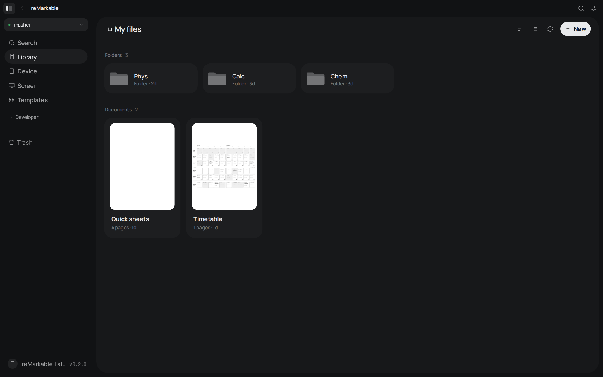
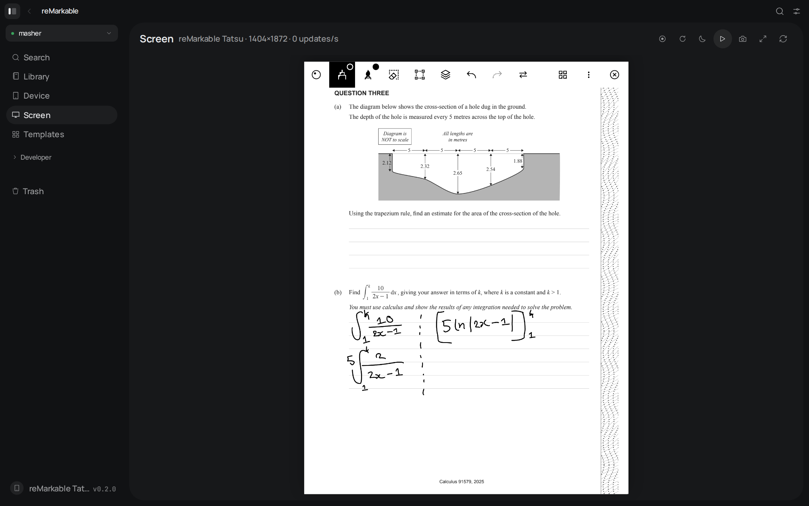

# reMarkable WebUI

Local web interface for reMarkable paper tablets over SSH. Works over the USB cable with no wifi, and over wifi when SSH is enabled there.

Desktop packages use Tauri 2 and include the Node.js backend. The toolbar has a sidebar toggle, search and settings. Window controls follow the platform; macOS keeps its native traffic lights. Fonts ship with the app and finish loading before the first screen appears.






## Features

- Library with folders, notebooks, PDFs and EPUBs: thumbnails, search (⌘K), grid and list views, drag and drop. Rename, move, pin, trash, delete, new folders and notebooks.
- Upload PDF, EPUB and rmdoc files. The tablet imports them live through its USB web interface, no restart.
- Page viewer: strokes rendered from the `.rm` v6 files, PDF pages underneath, templates from the tablet.
- Export as PDF (rendered by the tablet), rmdoc, or a single page as SVG.
- Device panel with model, firmware, battery, storage and network. Restart xochitl, reboot, power off.
- Live screen mirror with rotation, inversion, screenshots and WebM recording.
- Template gallery, custom `.template` upload and editing.
- File explorer and terminal for the whole tablet.

## Setup

Needs Node.js 22 or newer and SSH on the tablet. reMarkable 1 and 2 have it on by default. Paper Pro needs developer mode under Settings › General › Software › Advanced, and turning it on factory resets the tablet. The root password is at the bottom of Settings › General › Help › Copyrights and licenses.

Over USB the tablet answers on `10.11.99.1`. To set up Wi-Fi, save and connect your tablet over USB, join the same Wi-Fi network as your computer, then open Devices and click **Set up Wi-Fi**. The app discovers the wireless address, enables Wi-Fi SSH through the tablet's built-in helper when needed, and tests the saved password or SSH key against the same tablet before saving a Wi-Fi connection. Your USB connection stays available. Once the library opens over Wi-Fi, you can unplug the cable.

Keep the tablet awake while using Wi-Fi. **Set up Wi-Fi** appears on USB connections only and reuses a matching saved Wi-Fi connection. After a successful connection, the app remembers the tablet's SSH identity. If the connection drops or its IP address changes, the app searches the connected local networks for that identity and reconnects automatically, updating the same saved profile. Discovery checks identity before sending credentials. Retries pause for up to 30 seconds between attempts; **Cancel** or **Disconnect** stops them. Existing connections need one successful connection after upgrading to learn the identity; if their saved address is already stale, connect by USB and run setup once.

Discovery supports local IPv4 networks and checks a bounded part of very large subnets. It cannot reach a sleeping tablet or bypass guest-network isolation. The screen mirror resumes when the connection returns. Uploads and PDF export still need "USB web interface" enabled under Settings › Storage.

```sh
npm install
npm run dev
```

The dev server is on http://localhost:5173 with the API on port 8787. For production run `npm run build` then `npm start`, both served from port 8787 (or `PORT`). Release tarballs ship the client prebuilt: unpack, `npm ci --omit=dev`, `npm start`.

Saved devices, including passwords, live in `~/.config/remarkable-webui/devices.json` with mode 600. The server listens on `127.0.0.1` only.

## macOS USB connection troubleshooting

If the app reports `EHOSTUNREACH` while Apple's `/usr/bin/ssh` can reach the tablet, macOS may be restricting local-network access for the app or Node process. Check System Settings › Privacy & Security › Local Network. This error can also mean a real network failure; successful ping alone does not prove SSH is reachable.

If system SSH works but the app still cannot connect, keep this command running in Terminal (replace the key path with your saved tablet key):

```sh
/usr/bin/ssh -N -o ExitOnForwardFailure=yes -o ServerAliveInterval=15 -o ServerAliveCountMax=3 -i ~/.ssh/your_tablet_key -L 127.0.0.1:2222:10.11.99.1:22 root@10.11.99.1
```

Omit `-i ~/.ssh/your_tablet_key` to use password authentication. In Devices, add or edit a connection with host `127.0.0.1`, port `2222`, your usual tablet login and **USB attached** checked. The USB indicator probes that endpoint, and **Set up Wi-Fi** stays available. Wi-Fi setup saves a separate profile on the tablet's SSH port 22; it keeps your forwarded USB endpoint unchanged and verifies the tablet's SSH identity before sending credentials.

The app does not start or manage this tunnel. Stop it with Ctrl-C and restart it after unplugging, a tablet reboot or a Mac restart. Keepalive options detect a broken connection but do not restart it. USB-marked profiles are excluded from automatic Wi-Fi discovery so discovery cannot overwrite the tunnel address.

Packages remain unsigned unless you configure signing credentials. Signing and notarization are separate release setup; this workaround does not establish which macOS subsystem refused the original connection.

## Desktop builds

Install Node.js 22+, Rust and the [Tauri prerequisites](https://v2.tauri.app/start/prerequisites/) for your platform, then:

```sh
npm ci
npm run desktop:dev
```

Build a release installer with `npm run desktop:build`. Outputs are under `src-tauri/target/release/bundle/`. Linux can select formats with `npm run desktop:build -- --bundles deb,appimage`. Windows uses `--bundles nsis`; macOS uses `--bundles dmg`.

The build bundles the backend and copies the build machine's Node executable. Build on the same OS and architecture as the installer. End users do not need Node or Rust. The desktop backend uses a random loopback port and a token unique to each app session. Closing the app stops that backend. Saved tablet connections share the web app's config directory.

The `desktop` workflow builds Linux x64 on Ubuntu 22.04, Windows x64 and both macOS architectures. Run it manually for downloadable CI artifacts. Version tags attach installers to the GitHub release alongside the web archive. Packages are unsigned unless signing credentials are configured on the build machine.

## Development checks

```sh
npm run check
npm test
npm run build
npx playwright install chromium
npm run test:ui
npm run desktop:prepare
node tools/smoke-sidecar.mjs
```

Linux desktop builds verify permissions stored in the finished AppImage and launch it under Xvfb to check that its window appears and its bundled backend accepts authenticated requests. To run these checks locally, install `squashfs-tools`, `xvfb`, `x11-utils` and `dbus-x11`, then run `node tools/check-appimage.mjs path/to/app.AppImage` and `xvfb-run -a dbus-run-session -- node tools/smoke-appimage.mjs path/to/app.AppImage`.

After building on Windows, run `node tools/smoke-desktop.mjs` to launch the actual app with temporary settings and verify service startup, authenticated requests and shutdown. Pass an executable path to check an installed copy. Startup errors are written to `tablet-service.log` in the app's log directory; the error screen shows the path.

Tests use temporary device storage and a local SSH test server. Browser tests mock the tablet API. The HTTP handlers are grouped under `server/routes/`; `server/app.ts` creates the API independently of process startup. Library selection, menus and dialogs live in separate modules. Route components load on demand.

## Notes

- xochitl reads document metadata at startup, so after a rename, move, delete, or a new folder or notebook the app restarts it (about two seconds, the open notebook closes). Turn that off per device in Settings › General to batch changes and restart from the sidebar.
- Screen mirror reads `/dev/fb0` on reMarkable 1, xochitl's memory on reMarkable 2 (reStream offsets) and the DRM buffers on Paper Pro and newer (goMarkableStream method). A static helper (`tools/rmfb.c`, prebuilt in `server/bin/`) is copied to `/home/root/.cache/remarkable-webui/` and streams only the rows that changed. Rebuild it with `zig cc -target aarch64-linux-musl -O2 -static -s -o server/bin/rmfb-aarch64 tools/rmfb.c`.
- Custom templates go into the document store as a `.template` file next to a `TemplateType` `.metadata`, the way reMarkable's own Methods templates arrive since firmware 3.17. They survive updates and nothing on the read-only root partition changes. PNG and SVG templates are not supported there.
